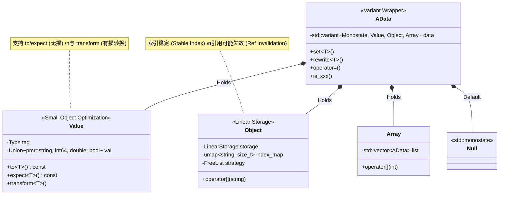
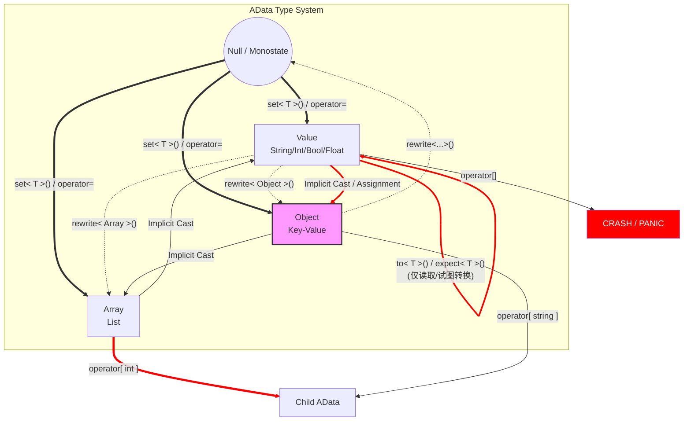

# adata

## 目录
- [adata](#adata)
  - [目录](#目录)
  - [总纲](#总纲)
  - [当前Features与规划](#当前features与规划)
    - [Features](#features)
    - [规划](#规划)
  - [详解](#详解)
    - [adata的基础架构](#adata的基础架构)
  
## 总纲
AData是一个动态的数据与配置文件解决方案,具备类似动态语言如Python/Javascript等的灵活性与不错的安全性(具体的各种BUG我还没测试出来,需要漫长的维护期)与性能,同时支持数据校验.AData并不绑定一个数据存储形式(JSON,XML,TOML...)而是力图成为一个比较通用的数据解决方案,类似这些数据存储形式的IR.

## 当前Features与规划
### Features
<details>
<summary>支持类似动态语言的食用方式</summary>

> **核心体验：** 像用 Python/JS 一样操作 C++ 强类型数据，内置缓存机制，拒绝冗余拷贝。

```cpp
    AData doc;
    // 1. 基础类型无缝赋值 (支持 string_view-like, bool, int64, double)
    doc["name"] = "adata gen 5";
    doc["version"] = 5.0;
    doc["active"] = true;

    // 2. 数组：自动扩展 (Auto-expand)，无需手动 resize
    doc["tags"][0] = "easy";
    doc["tags"][2] = "elegant"; // 索引 1 会自动处理

    // 3. 对象：多级路径自动递归创建
    doc["meta"]["author"]["github"] = "aaaa0ggmc";

    // 4. 安全性：严禁隐式 Cast。非法访问将触发 Panic (带栈输出的 abort)
    // doc = doc["meta"]; //同类型 安全自赋值：OK
    // doc = doc["tags"]; // Object to Array? C++里不是这样的!!
```

</details>

<details>
<summary>预制菜已经支持 JSON</summary>

> **核心体验：** 高度集成的 IO 流。不仅是解析，更是对数据流的极致控制。

```cpp
    // 1. 灵活装载 (Memory / File / alib5 FileEntry)
    doc.load_from_memory(R"({"status": "ok"})");
    doc.dump_to_file("./config.json");

    // 2. 深度集成：与 alogger 完美配合，高效序列化
    aout << doc << fls; 

    // 3. 极致定制：通过 JSONConfig 实现精细控制
    data::JSONConfig cfg {
        .float_precision = 2,
        .sort_object = true, // 字典序输出
        .filter = [](auto key, auto& node) { 
            return (key == "secret") ? Discard : Keep; // 动态过滤字段
        }
    };
    std::cout << doc.str(data::JSON(cfg)); // 缩写版 dump

```

</details>

<details>
<summary>支持数据校验与归一. 小学习成本, 但好用!</summary>

> **核心体验：** 声明式 Schema。将繁琐的 `if(contains)` 判定转化为简洁的 DSL 约束。

```cpp
    // 1. 定义 Schema：支持类型约束、必填项、默认值填充
    Validator vl = Validator::from_adata(R"({
        "name" : "REQUIRED TYPE STRING VALIDATE not_empty",
        "id"   : ["TYPE INT", 1024, "<- 自动填充默认值"],
        "arr"  : ["TYPE ARRAY MIN 1", ["TYPE INT"]] 
    })");

    // 2. 一键校验：获取详细的错误链路
    AData input; 
    input["name"].set_null(); 

    auto result = vl.validate(input);
    if (!result.success) {
        // 输出示例: ".name : Expected String, got Null"
        std::cout << "Error: " << result.recorded_errors[0];
    }

```
</details>

### 规划
- 支持Acessor这层访问封装从而彻底地理论上支持任何数据类型而非目前的JSON
- (等C++26)支持静态反射绑定到类
- 加入一些有用的validates预制菜
- 提供对TOML的解析(因为老版本的ADATA就是提供了对JSON&TOML的解析的)

## 详解
### adata的基础架构
<detail>
<summary>给ai的美人鱼提示词</summary>
基础类型
Value->{pmr::string,int64_t,double,bool} managed by type{STRING,BOOL,INT,FLOATING}
| |
提供
| |
to\< T > expect\< T > 不影响内部类型的转换
transform\< T > 影响内部类型的转换

Object->{alib5::ecs::detail::LinearStorage,umap std::pmr::string,size_t} 提供线性存储,因此纯引用可能失效,采用freelist策略,索引不变

Array->{vector} 

AData std::varaint \< std::monostate,Value,Object,Array > 
set\< T >() 提供强制初始化
rewrite\< T >(T && val) 提供强制重写
operator = 提供隐式赋值
支持 Null <==> Array/Object/Value
不支持 Value Array Object之间互相转化,会直接panic
转发 operator=给Value
转发 [ index ]给Array
转发 [ name ] 给Object
支持is_xxx()判断,支持xxx()返回类型(类型不对会panic)
</detail>



