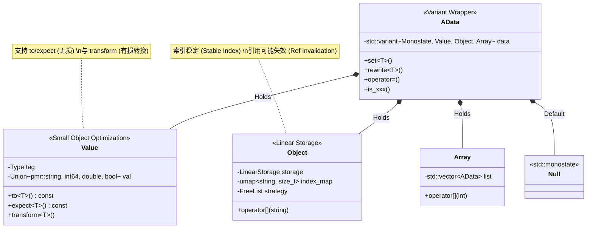
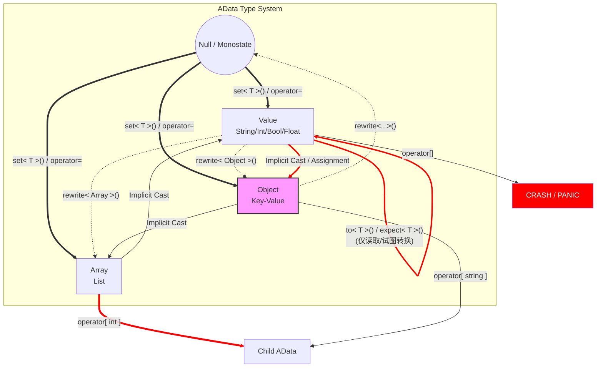

# adata

## 目录
- [adata](#adata)
  - [目录](#目录)
  - [总纲](#总纲)
  - [当前Features与规划](#当前features与规划)
    - [Features](#features)
    - [规划](#规划)
  - [性能](#性能)
    - [测试平台](#测试平台)
    - [VS nlohmann/json](#vs-nlohmannjson)
    - [校验性能](#校验性能)
      - [输出](#输出)
  - [CV              :2.431%](#cv--------------2431)
    - [加载json性能,主要得益于rapidjson SAX模式](#加载json性能主要得益于rapidjson-sax模式)
      - [输出](#输出-1)
  - [](#)
  - [CV              :1.422%](#cv--------------1422)
  - [详解](#详解)
    - [adata的基础架构](#adata的基础架构)
    - [AI总结出的解析](#ai总结出的解析)
      - [AData 核心机制详解 (Internal Mechanism)](#adata-核心机制详解-internal-mechanism)
        - [1. 内存模型：PMR (Polymorphic Memory Resource)](#1-内存模型pmr-polymorphic-memory-resource)
        - [2. Value 类型：双重表示与惰性同步 (Lazy Sync)](#2-value-类型双重表示与惰性同步-lazy-sync)
          - [2.1 存储结构](#21-存储结构)
          - [2.2 读写机制](#22-读写机制)
          - [2.3 转换策略](#23-转换策略)
        - [3. Object 存储：线性布局 (Linear Storage)](#3-object-存储线性布局-linear-storage)
        - [4. Array 特性：自动策略](#4-array-特性自动策略)
        - [5. 类型安全系统](#5-类型安全系统)
          - [5.1 赋值与重写规则](#51-赋值与重写规则)
          - [5.2 Panic 机制](#52-panic-机制)
        - [6. IO 扩展性 (Policy Design)](#6-io-扩展性-policy-design)
    - [AI总结的类型转换机制](#ai总结的类型转换机制)
      - [AData 类型隐式转换与流转机制详解](#adata-类型隐式转换与流转机制详解)
        - [1. 拓扑层级：严格的类型防火墙](#1-拓扑层级严格的类型防火墙)
          - [1.1 禁止隐式拓扑突变](#11-禁止隐式拓扑突变)
          - [1.2 合法的拓扑重置](#12-合法的拓扑重置)
        - [2. 数值层级：流动的 Value 状态机](#2-数值层级流动的-value-状态机)
          - [2.1 赋值即突变 (Assignment is Mutation)](#21-赋值即突变-assignment-is-mutation)
          - [2.2 转换矩阵 (The Conversion Matrix)](#22-转换矩阵-the-conversion-matrix)
          - [2.3 字符串解析的“宽容度”](#23-字符串解析的宽容度)
        - [3. 投影视图：Expect 与 To 机制](#3-投影视图expect-与-to-机制)
          - [3.1 机制详解](#31-机制详解)
          - [3.2 脏数据同步 (Back Sync)](#32-脏数据同步-back-sync)
        - [4. 总结图示](#4-总结图示)
        - [5. 核心逻辑速查表](#5-核心逻辑速查表)
  - [AI总结出的VALIDATOR语法](#ai总结出的validator语法)
    - [1. 基础语法规则 (DSL)](#1-基础语法规则-dsl)
      - [1.1 核心指令表](#11-核心指令表)
      - [1.2 支持的类型 (`TYPE <T>`)](#12-支持的类型-type-t)
    - [2. 自定义校验器 (`VALIDATE`) 语法详解](#2-自定义校验器-validate-语法详解)
      - [语法格式](#语法格式)
      - [示例](#示例)
    - [3. 结构化校验](#3-结构化校验)
      - [3.1 对象 (Object)](#31-对象-object)
      - [3.2 数组 (Array)](#32-数组-array)
      - [A. List 模式 (同构数组)](#a-list-模式-同构数组)
      - [B. Tuple 模式 (异构数组)](#b-tuple-模式-异构数组)
  - [4. 归一化与副作用 (Normalization)](#4-归一化与副作用-normalization)
  - [5. 完整 Schema 示例](#5-完整-schema-示例)
  
## 总纲
AData是一个动态的数据与配置文件解决方案,具备类似动态语言如Python/Javascript等的灵活性与不错的安全性(具体的各种BUG我还没测试出来,需要漫长的维护期)与性能,同时支持数据校验.AData并不绑定一个数据存储形式(JSON,XML,TOML...)而是力图成为一个比较通用的数据解决方案,类似这些数据存储形式的IR.

## 当前Features与规划
### Features
<details>
<summary>支持类似动态语言的食用方式</summary>

> **核心体验：** 像用 Python/JS 一样操作 C++ 强类型数据，内置缓存机制，拒绝冗余拷贝。

```cpp
    AData doc;
    // 1. 基础类型无缝赋值 (支持 string_view-like, bool, int64, double)
    doc["name"] = "adata gen 5";
    doc["version"] = 5.0;
    doc["active"] = true;

    // 2. 数组：自动扩展 (Auto-expand)，无需手动 resize
    doc["tags"][0] = "easy";
    doc["tags"][2] = "elegant"; // 索引 1 会自动处理

    // 3. 对象：多级路径自动递归创建
    doc["meta"]["author"]["github"] = "aaaa0ggmc";

    // 4. 安全性：严禁隐式 Cast。非法访问将触发 Panic (带栈输出的 abort)
    // doc = doc["meta"]; //同类型 安全自赋值：OK
    // doc = doc["tags"]; // Object to Array? C++里不是这样的!!
```

</details>

<details>
<summary>预制菜已经支持 JSON</summary>

> **核心体验：** 高度集成的 IO 流。不仅是解析，更是对数据流的极致控制。

```cpp
    // 1. 灵活装载 (Memory / File / alib5 FileEntry)
    doc.load_from_memory(R"({"status": "ok"})");
    doc.dump_to_file("./config.json");

    // 2. 深度集成：与 alogger 完美配合，高效序列化
    aout << doc << fls; 

    // 3. 极致定制：通过 JSONConfig 实现精细控制
    data::JSONConfig cfg {
        .float_precision = 2,
        .sort_object = true, // 字典序输出
        .filter = [](auto key, auto& node) { 
            return (key == "secret") ? Discard : Keep; // 动态过滤字段
        }
    };
    std::cout << doc.str(data::JSON(cfg)); // 缩写版 dump

```

</details>

<details>
<summary>支持数据校验与归一. 小学习成本, 但好用!</summary>

> **核心体验：** 声明式 Schema。将繁琐的 `if(contains)` 判定转化为简洁的 DSL 约束。

```cpp
    // 1. 定义 Schema：支持类型约束、必填项、默认值填充
    Validator vl = Validator::from_adata(R"({
        "name" : "REQUIRED TYPE STRING VALIDATE not_empty",
        "id"   : ["TYPE INT", 1024, "<- 自动填充默认值"],
        "arr"  : ["TYPE ARRAY MIN 1", ["TYPE INT"]] 
    })");

    // 2. 一键校验：获取详细的错误链路
    AData input; 
    input["name"].set_null(); 

    auto result = vl.validate(input);
    if (!result.success) {
        // 输出示例: ".name : Expected String, got Null"
        std::cout << "Error: " << result.recorded_errors[0];
    }

```
</details>

### 规划
- 支持Acessor这层访问封装从而彻底地理论上支持任何数据类型而非目前的JSON
- (等C++26)支持静态反射绑定到类
- 加入一些有用的validates预制菜
- 提供对TOML的解析(因为老版本的ADATA就是提供了对JSON&TOML的解析的)

## 性能
### 测试平台
<pre>
OS: Arch Linux x86_64
Kernel: Linux 6.18.7-arch1-1
Shell: bash 5.3.9
DE: KDE Plasma 6.5.5
WM: KWin (Wayland)
CPU: AMD Ryzen 9 8945HX (32) @ 5.46 GHz
GPU 1: NVIDIA GeForce RTX 5060 Max-Q / Mobile [Discrete]
GPU 2: AMD Radeon 610M [Integrated]
Memory: 16.31 GiB / 30.63 GiB (53%)
Swap: 79.35 MiB / 40.00 GiB (0%)
Disk (/): 1.66 TiB (20%) - btrfs

Compiled with
1. CMake Release Mode
2. gcc (GCC) 15.2.1 20260103
</pre>

### VS nlohmann/json
| 性能指标 | Release **AData** | Release **nlohmann** | 性能差异 (AData 优势) |
| --- | --- | --- | --- |
| **平均耗时 (Average)** | **13.99 ns** | 17.52 ns | **+20.1%** |
| **最短耗时 (Shortest)** | **11.87 ns** | 14.25 ns | +16.7% |
| **最长耗时 (Longest)** | **41.56 ns** | 79.55 ns | **+47.8%** |
| **总计用时 (TimeCost)** | 13.99 ms | 17.52 ms | -3.52 ms |
| **标准差 (Stddev)** | 1.59e-06 | 3.94e-06 | 波动更小 |
| **变异系数 (CV)** | **11.41%** | 22.50% | **稳定性高 1 倍** |
| **运行次数 (RunTimes)** | 1,000,000 | 1,000,000 | - |
代码:
```cpp
    AData d;
    d["main"] = "Hello";
    d["sub"][0] = 1;

    nlohmann::json j;
    j["main"] = "Hello";
    j["sub"][0] = 1;

    aout << Benchmark([&d]{
        // 这里返回的是引用哦
        d["sub"][0].value().transform<int>() ++;
    }).run(1000,1000).name("Release AData") << fls;

    aout << Benchmark([&j]{
        j["sub"][0].get_ref<nlohmann::json::number_integer_t&>()++;
    }).run(1000,1000).name("Release nlohmann") << fls;
```

### 校验性能
```cpp    
    AData schema;
    schema.load_from_memory(R"({
        "name" : ["TYPE STRING","Hello"],
        "obj" : {
            "name" : ["","What?"],
            "ids" : [
                "TYPE ARRAY MIN 1 MAX 100",
                ["TYPE INT",0]    
            ]
        }
    })");
    Validator vl;
    {
        // 编译大致用时
        Clock clk;
        vl.from_adata(schema);
        double t = clk.get_offset();
        std::cout << "Compilation costed " << t*1000 << " us" << std::endl;
    }

    AData nerd;
    vl.validate(nerd);
    aout << nerd << fls;

    aout << Benchmark([&vl]{
        AData d;
        vl.validate(d);
    }).run(1000, 100).name("validate cost") << fls;
```

#### 输出
<pre>
Compilation costed 40.368 us
{
  "name" : "Hello",
  "obj" : {
    "name" : "What?",
    "ids" : [
      0
    ]
  }
}

-----------------------
validate cost

TimeCost        :75.94456699999998ms
RunTimes        :100000
Average         :759.445654693991ns
ShortestAvgCall :718.317ns
LongestAvgCall  :851.296ns
Stddev          :1.8462227e-05
CV              :2.431%
--------------------------------
</pre>

### 加载json性能,主要得益于rapidjson SAX模式
```cpp
    aout << Benchmark([]{
        AData schema;
        schema.load_from_memory(R"({
            "name" : ["TYPE STRING","Hello"],
            "obj" : {
                "name" : ["","What?"],
                "ids" : [
                    "TYPE ARRAY MIN 1 MAX 100",
                    ["TYPE INT",0]    
                ]
            }
        })");
    }).run(1000, 100).name("parse cost") << fls;
```
#### 输出
<pre>
-----------------------
parse cost

TimeCost        :70.16121799999998ms
RunTimes        :100000
Average         :701.6121526248753ns
ShortestAvgCall :680.3240000000001ns
LongestAvgCall  :736.127ns
Stddev          :9.9766135e-06
CV              :1.422%
--------------------------------
</pre>

## 详解
### adata的基础架构

<detail>
<summary>给ai的美人鱼提示词</summary>

基础类型
Value->{pmr::string,int64_t,double,bool} managed by type{STRING,BOOL,INT,FLOATING}
| |
提供
| |
to\< T > expect\< T > 不影响内部类型的转换
transform\< T > 影响内部类型的转换

Object->{alib5::ecs::detail::LinearStorage,umap std::pmr::string,size_t} 提供线性存储,因此纯引用可能失效,采用freelist策略,索引不变

Array->{vector} 

AData std::varaint \< std::monostate,Value,Object,Array > 
set\< T >() 提供强制初始化
rewrite\< T >(T && val) 提供强制重写
operator = 提供隐式赋值
支持 Null <==> Array/Object/Value
不支持 Value Array Object之间互相转化,会直接panic
转发 operator=给Value
转发 [ index ]给Array
转发 [ name ] 给Object
支持is_xxx()判断,支持xxx()返回类型(类型不对会panic)

</detail>






### AI总结出的解析
#### AData 核心机制详解 (Internal Mechanism)

AData 的内核设计旨在平衡“动态语言的灵活性”与“C++ 的严格性能要求”。不同于传统的 JSON 库，AData 构建了一套基于 `std::pmr` 的微型运行时，采用 SoA (Structure of Arrays) 存储布局与惰性同步机制。

##### 1. 内存模型：PMR (Polymorphic Memory Resource)

全库采用 C++17 `std::pmr` 内存资源模型。

* **统一分配器**：所有节点（`AData`, `Object`, `Array`, `Value`）均持有 `std::pmr::memory_resource*` 指针。
* **局部性优化**：支持将数据分配在栈上（`monotonic_buffer_resource`）或特定的内存池中，避免了传统动态库频繁的系统级 Heap Allocation，显著提升缓存局部性 (Cache Locality)。

##### 2. Value 类型：双重表示与惰性同步 (Lazy Sync)

`Value` 类型采用“原始值”与“字符串缓存”并存的策略，以最小化格式化开销。

###### 2.1 存储结构

内部维护一个 `Union` 用于存储机器原生类型，以及一个 `std::pmr::string` 用于存储文本表示。

* **Union**：直接存储 `int64_t`, `double`, `bool`。
* **Cache**：`std::pmr::string data`。
* **Dirty Flag**：`bool data_dirt` 标记当前缓存是否失效。

###### 2.2 读写机制

* **写入 (Write)**：当写入数值（如 `int`）时，仅更新 Union 并标记 `data_dirt = true`。此时**不进行**字符串格式化，实现零开销写入。
* **读取 (Read)**：
* **取数值**：直接返回 Union 内的值，无视字符串。
* **取字符串**：检查 `data_dirt`。若为脏，触发 `sync_to_string()` 将数值格式化为字符串并缓存，随后返回字符串视图。


###### 2.3 转换策略

* **`transform<T>()` (有损转换)**：直接修改内部 `Type` 标记。例如从 `INT` 转为 `FLOATING`，内部存储会发生实质改变。
* **`expect<T>()` / `to<T>()` (无损投影)**：不改变内部状态，尝试将当前值投影为目标类型。
* *示例*：若当前持有 `STRING "123"`，调用 `to<int>()` 会使用 `std::from_chars` 解析并返回 `123`，但内部仍保持为 `STRING` 类型。


##### 3. Object 存储：线性布局 (Linear Storage)

为了优化遍历性能与内存占用，`Object` 未直接使用 `std::map` 存储节点。

* **分离式存储**：
* **数据区**：`ecs::detail::LinearStorage<AData>` (类似 `std::vector`)。所有 Value 节点在内存中连续排列。
* **索引区**：`unordered_map<string, size_t>`。仅存储 Key 与其在数据区中的索引 (Index)。


* **性能特征**：
* **遍历**：直接线性扫描数据区，极度亲和 CPU 缓存。
* **序列化**：Dump 操作比传统 Map 结构快数倍。


* **注意事项**：由于底层采用线性动态数组，**扩容会导致指针失效**。因此提供了 `safe_visit` 接口返回索引或 `RefWrapper`，而非裸指针。

##### 4. Array 特性：自动策略

`Array` 封装了 `std::pmr::vector<AData>`，引入了动态脚本语言的便利特性。

* **自动扩容 (Auto Expand)**：写入索引越界且在阈值（`conf_array_auto_expand`，默认 4）范围内时，会自动 Resize 数组并填充空洞，无需手动 `push_back`。
* **负数索引**：支持 Python 风格的负索引访问（如 `-1` 表示最后一个元素）。

##### 5. 类型安全系统

`AData` 是 `std::variant<Monostate, Value, Object, Array>` 的严格封装。

###### 5.1 赋值与重写规则

为防止 C++ 中常见的隐式构造导致的意外数据覆盖，AData 区分了“赋值”与“重写”：

* **赋值 `operator=**`：**强类型检查**。
* 若当前类型与右值类型不匹配（且非 Null），会直接触发 **Panic (`std::abort`)**。
* *设计意图*：禁止隐式地将一个 Object 覆盖为 Array。


* **重写 `rewrite<T>()**`：**破坏性重建**。
* 显式销毁当前数据，重置为目标类型。这是改变节点类型的唯一合法途径。


###### 5.2 Panic 机制

核心坚持“Fail Fast”原则。对于逻辑错误（如隐式类型转换、访问不存在的 Key 且未做检查），框架会通过 `alogger` 输出栈信息后直接终止程序，而非抛出可被忽略的异常。

##### 6. IO 扩展性 (Policy Design)

IO 接口（`load_from_memory` / `dump`）采用策略模式设计。

* **解耦**：AData 内核不绑定 JSON。
* **扩展**：任何满足 `IsDataPolicy` 概念（Concept）的类（实现了 `parse` 和 `dump`）均可作为后端。这使得 AData 可作为 XML, TOML, YAML 或二进制协议的通用中间表示层 (IR)。

### AI总结的类型转换机制
#### AData 类型隐式转换与流转机制详解

AData 的类型系统采用了 **“拓扑严苛，数值流动” (Topologically Strict, Value Fluid)** 的混合策略。这意味着在数据结构层级（对象/数组/值）之间存在严格的防火墙，而在数值层级（Int/Float/String/Bool）内部则允许高效的自动流转。

##### 1. 拓扑层级：严格的类型防火墙

在 `AData` 节点层级（即 `std::variant<Monostate, Value, Object, Array>`），隐式类型转换受到严格限制，以防止配置结构的意外破坏。

###### 1.1 禁止隐式拓扑突变

AData **禁止** 通过赋值操作符 `operator=` 隐式地改变一个已存在节点的顶层类型（Top-Level Type）。

* **规则**：当 `LHS`（左值）与 `RHS`（右值）均非 `Null` 且类型不一致时，触发 **Panic**。
* **代码依据**：
```cpp
// AData::operator=(const AData & val)
if(get_type() != TNull && val.get_type() != TNull && get_type() != val.get_type()){
    panic_if(..., "Implicit type cast is forbidden."); // 立即终止
}

```


* **场景示例**：
* `Object = Array`：❌ **Panic** (防止将配置项字典误覆盖为列表)
* `Value = Object`：❌ **Panic**
* `Array = Value`：❌ **Panic**


###### 1.2 合法的拓扑重置

若必须改变节点类型（例如将一个 `Value` 节点重构为 `Object`），必须使用显式的破坏性接口：

* **`rewrite<T>(val)`**：语义为“销毁旧宇宙，重建新宇宙”。
* **`set_null()`**：先归零，再赋值。

---

##### 2. 数值层级：流动的 Value 状态机

一旦进入 `Value` 类型内部（`Value::Type`），AData 提供了极高灵活性的隐式转换机制。这部分逻辑主要由 `Value::transform<T>` 和 `Value::reconstruct<T>` 驱动。

###### 2.1 赋值即突变 (Assignment is Mutation)

当你对一个 `Value` 节点赋值不同类型的 C++ 原生数据时，`Value` 内部的 `Union` 及其类型标记（Tag）会发生**物理突变**。

* **机制**：调用 `reconstruct<T>()`。
* **流程**：
1. 判断目标类型 `T`。
2. 切换内部 `Type` 枚举（如 `INT` -> `FLOATING`）。
3. 标记 `data_dirt = true`（旧的字符串缓存失效）。
4. 写入 `Union` 对应字段。


###### 2.2 转换矩阵 (The Conversion Matrix)

在调用 `transform<T>()` 或进行跨类型数值操作时，遵循以下硬编码的转换逻辑：

| 源类型 (Source) | 目标类型 (Target) | 转换逻辑 (Implementation) | 备注 |
| --- | --- | --- | --- |
| **BOOL** | INT / FLOAT | `true` -> `1`, `false` -> `0` | 标准 C++ 提升 |
| **INT** | BOOL | `val != 0` | 0 为 false，其余为 true |
| **INT** | FLOAT | `static_cast<double>(val)` | 可能丢失精度 (int64 -> double) |
| **FLOAT** | INT | `static_cast<int64_t>(val)` | 截断小数部分 |
| **FLOAT** | BOOL | `val != 0.0` | 浮点判零 |
| **STRING** | INT / FLOAT | `std::from_chars` | 解析字符串，若解析失败可能触发 Error |
| **STRING** | BOOL | **无直接隐式转换** | 通常需显式解析 |
| **ANY** | STRING | `sync_to_string()` (Lazy) | 惰性生成，只有读取时才转换 |

###### 2.3 字符串解析的“宽容度”

当 `STRING` 隐式转换为数值（如在 JSON 中读取 `"123"` 为 `int`）时：

* 使用 `ext::to_T` (基于 `std::from_chars`)。
* **Trim 机制**：自动去除首尾空格 (`str::trim`)。
* **错误处理**：若 `IsDataPolicy` 开启 `invoke_err`，解析失败（如 `"abc"` 转 `int`）会触发错误回调；否则返回 `0` 或默认值。

---

##### 3. 投影视图：Expect 与 To 机制

除了物理转换，AData 提供了 **"虚转换" (Virtual Conversion)** 机制，即 `expect<T>` 和 `to<T>`。这允许用户以类型 `T` 的视角去观察数据，而**不改变**数据本身的存储类型。

###### 3.1 机制详解

* **只读性**：该操作是 `const` 的，不会修改 `Value` 内部的 `Type` 标记。
* **临时性**：如果需要类型转换（如 String -> Int），转换结果是临时的（R-value），不会回写到存储中。

###### 3.2 脏数据同步 (Back Sync)

这里存在一个特例：**当以 String 视角观察数值时**。

```cpp
// Value::expect<StringLike>
if(data_dirt) back_sync(ext::to_string(val));

```

虽然 `expect` 是 const 方法，但为了性能，它会利用 `mutable` 关键字触发一次 **惰性同步**。这确保了下次读取字符串时无需再次格式化。

---

##### 4. 总结图示

```mermaid
graph TD
    subgraph Strict_Topology [AData Topology (Strict)]
        O[Object]
        A[Array]
        V[Value]
        
        O --"operator="--> A
        linkStyle 0 stroke:red,stroke-width:4px,color:red;
        A --"operator="--> V
        linkStyle 1 stroke:red,stroke-width:4px;
        V --"operator="--> O
        linkStyle 2 stroke:red,stroke-width:4px;
        
        note1[❌ Explicit Rewrite Required]
    end

    subgraph Fluid_Value [Value Internals (Fluid)]
        I(Int64)
        F(Double)
        B(Bool)
        S(String Cache)
        
        I <--"Implicit Cast"--> F
        F <--"Implicit Cast"--> B
        B <--"Implicit Cast"--> I
        
        I == "reconstruct" ==> S
        S == "std::from_chars" ==> I
        S == "std::from_chars" ==> F
        
        note2[✅ Auto Mutation / Lazy Sync]
    end

```

##### 5. 核心逻辑速查表

1. **`doc["key"] = 100;`**
* 若 `"key"` 不存在：创建 `Null` -> 隐式升级为 `Value(Int)`。
* 若 `"key"` 是 `String`：`Value` 内部类型突变为 `Int`，标记 String Cache 脏。
* 若 `"key"` 是 `Object`：**Panic** (禁止隐式覆盖结构)。


2. **`int x = doc["str_123"];` (需显式调用 `to<int>()`)**
* 调用 `to<int>()` -> 调用 `expect<int>()`。
* `Value` 保持 `STRING` 类型。
* 解析 `"123"` 返回 `123`。


3. **`doc["val"] = 1.5; doc["val"] = "text";`**
* 合法。`Value` 节点内部允许任意基本类型的反复横跳。

## AI总结出的VALIDATOR语法
AData 内置了一套强大的声明式校验系统。不同于 JSON Schema，AData 的 Schema 本身即是一个合法的 AData 对象。它不仅负责**校验 (Validation)**，还负责**数据归一化 (Normalization)**（如自动填充默认值、修正空节点类型）。

### 1. 基础语法规则 (DSL)

Schema 定义中的字符串被解析为一组指令序列。指令之间通过**空格**分隔。

**通用格式：**
`"KEYWORD [VALUE] KEYWORD [VALUE] ..."`

#### 1.1 核心指令表

| 指令 | 参数 | 描述 | 示例 |
| --- | --- | --- | --- |
| `REQUIRED` | 无 | **(默认)** 字段必须存在。 | `"REQUIRED TYPE INT"` |
| `OPTIONAL` | 无 | 字段允许缺失。 | `"OPTIONAL TYPE STRING"` |
| `TYPE` | `<T>` | 强制类型约束。 | `"TYPE DOUBLE"` |
| `MIN` | `<val>` | 数值：最小值；字符串/数组：最小长度。 | `"MIN 10"` |
| `MAX` | `<val>` | 数值：最大值；字符串/数组：最大长度。 | `"MAX 100"` |
| `VALIDATE` | `func(...)` | 调用注册的自定义校验函数。 | 见下方详细说明 |
| `OVERRIDE_CONFLICT` | 无 | 如果存在默认值,类型冲突时自动覆盖,不报错 | 无 |

#### 1.2 支持的类型 (`TYPE <T>`)

* **基础类型**：`INT`, `DOUBLE`, `BOOL`, `STRING`
* **容器类型**：`ARRAY`, `OBJECT`
* **特殊类型**：`NULL`, `VALUE` (接受任意标量), `NONE` (不限制类型)

---

### 2. 自定义校验器 (`VALIDATE`) 语法详解

`VALIDATE` 指令允许调用 C++ 端注册的回调函数。

> ⚠️ **重要提示：参数分隔符规范**
> 请务必注意，函数参数列表内 **不能使用逗号 (`,`)** 分隔，必须使用 **空格** 分隔。
> * ✅ **正确：** `"VALIDATE range(10 20)"`
> * ❌ **错误：** `"VALIDATE range(10, 20)"`
> 
> 

#### 语法格式

1. **无参数调用**：
`"VALIDATE function_name"`
2. **带参数调用**：
`"VALIDATE function_name(arg1 arg2 arg3)"`

#### 示例

```cpp
// 校验邮箱格式（无参）
"email": "TYPE STRING VALIDATE is_email"

// 校验数值范围（带参：最小值10，最大值20）
// 注意：括号内使用空格分隔
"score": "TYPE INT VALIDATE range(10 20)" 

// 复合校验：非空且必须是 hex 格式
"id": "TYPE STRING VALIDATE not_empty VALIDATE is_hex"

```

---

### 3. 结构化校验

#### 3.1 对象 (Object)

使用嵌套的 JSON 对象定义结构。Schema 会递归遍历校验子节点。

```json
{
    "user_id": "REQUIRED TYPE INT MIN 1",
    "meta": {
        "author": "TYPE STRING",
        "created_at": "OPTIONAL TYPE INT"
    }
}

```

#### 3.2 数组 (Array)

数组校验支持两种模式：**List (列表)** 和 **Tuple (元组)**。

确实，您观察得非常仔细。在源码逻辑中，当 `LIST` 的约束类型被指定为 `TYPE ARRAY` 时，解析逻辑会出现**分支**，第二个参数的语义会发生根本性变化。

这是因为 `List<Array>`（二维数组）需要递归描述内部数组的结构，而不能仅仅给一个默认值。

以下是重写后的 **4.2 数组 (Array) - List 模式** 文档部分：

---

#### A. List 模式 (同构数组)

List 模式用于校验元素类型相同的数组（如 `vector<T>`）。根据 `TYPE` 约束的不同，第二个参数的含义会有**重大区别**。

**通用语法**：

* 隐式：`["DSL Rule", Argument]`
* 显式：`["LIST", "DSL Rule", Argument]`

这里存在两种截然不同的行为模式：

**1. 基础值模式 (Scalar/Object)**
当 DSL Rule 中 **不包含** `TYPE ARRAY` 时（如 `TYPE INT`, `TYPE STRING`, `TYPE OBJECT`）。

* **语义**：第二个参数 `Argument` 被视为 **默认值 (Default Value)**。
* **行为**：若输入数组中存在空位（通常用于 Tuple 或定长 List 填充），或需要初始化该数组元素的场景，使用此值填充。

```json
{
    // [规则, 默认值]
    // 列表元素必须是 INT，若需要填充则填入 0
    "scores": ["TYPE INT", 0],
    
    // 列表元素是 OBJECT，若需要填充则填入 {"id": 0}
    "users": ["TYPE OBJECT", {"id": 0}]
}

```

**2. 嵌套数组模式 (List of Arrays)**
当 DSL Rule 中 **明确指定** `TYPE ARRAY` 时。

* **语义**：第二个参数 `Argument` 不再是默认值，而是 **子数组的 Schema 定义 (Inner Schema)**。
* **行为**：Validator 会递归地将此参数作为新的 Schema 节点进行解析，用于校验内部的子数组。
* **注意**：这种模式下，外层数组无法直接指定默认值（通常也不需要，因为它是容器的容器）。

```json
{
    // [规则, 子数组Schema]
    // 这是一个二维数组 matrix: [[int], [int], ...]
    "matrix": [
        "TYPE ARRAY",          // 1. 声明元素本身是数组
        ["TYPE INT", 0]        // 2. 这里的列表定义了内部子数组的结构：(List<Int>, default 0)
    ],

    // 三维数组示例 list<list<list<int>>>
    "tensor": [
        "TYPE ARRAY",          // 第一层是 Array
        [
            "TYPE ARRAY",      // 第二层是 Array (子 Schema)
            ["TYPE INT", 0]    // 第三层是 Int (孙子 Schema)
        ]
    ]
}

```

**代码级差异对比**：

* **常规：** `["TYPE INT", 100]`
* 解析器理解：这是一个 `int` 列表，默认值为 `100`。


* **特殊：** `["TYPE ARRAY", ["TYPE INT"]]`
* 解析器理解：这是一个 `List`，其元素类型为 `Array`。该内部 `Array` 的结构由第二个参数 `["TYPE INT"]` 定义。**第二个参数被作为 Schema 递归解析，而非作为数据值存储。**

#### B. Tuple 模式 (异构数组)

用于校验固定长度、特定位置类型不同的数组（如 `std::tuple<int, string>`）。

* **语法**：`["TUPLE", "Rule for Index 0", "Rule for Index 1", ...]`

```json
{
    // 校验一个坐标点 [x, y, label]
    // 强制要求数组长度为 3
    "point": ["TUPLE", "TYPE INT", "TYPE INT", "TYPE STRING"]
}

```

---

## 4. 归一化与副作用 (Normalization)

AData Validator 不仅仅是只读的检查器，它是一个**数据清洗器**。在校验过程中，它会对数据产生以下良性副作用（Side Effects）：

1. **默认值填充 (Default Injection)**：
如果字段在 Schema 中定义了默认值，且输入数据中该字段为 `NULL` 或不存在，Validator 会自动填入默认值。
2. **结构修正 (Structure Repair)**：
如果 Schema 要求字段是 `TYPE OBJECT` 或 `TYPE ARRAY`，但输入数据是 `NULL`，Validator 会将其初始化为空对象或空数组，以便后续进行子节点的填充。
3. **隐式类型转换 (Implicit Formatting)**：
虽然 `expect` 校验是只读的，但字符串形式的数值在通过校验后，可能会在内部触发缓存同步，加速后续读取。

---

## 5. 完整 Schema 示例

```cpp
R"({
    "server": {
        // 必填，非空字符串
        "host": "REQUIRED TYPE STRING VALIDATE not_empty",
        
        // 必填，范围 1-65535，注意 range 参数用空格分隔
        "port": "TYPE INT VALIDATE range(1 65535) DEFAULT 8080",
        
        // 选填，布尔值
        "ssl_enabled": ["TYPE BOOL", false]
    },
    "whitelist": [
        // 字符串列表，若列表为空则无默认值填充
        "TYPE STRING VALIDATE is_ip_address", 
        "127.0.0.1" 
    ],
    "version_info": [
        // 元组：[Major, Minor, Patch]
        "TUPLE", "TYPE INT", "TYPE INT", "TYPE INT"
    ]
})"

```